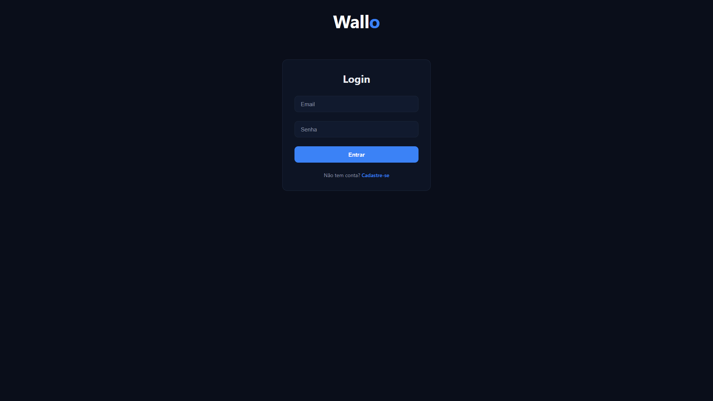
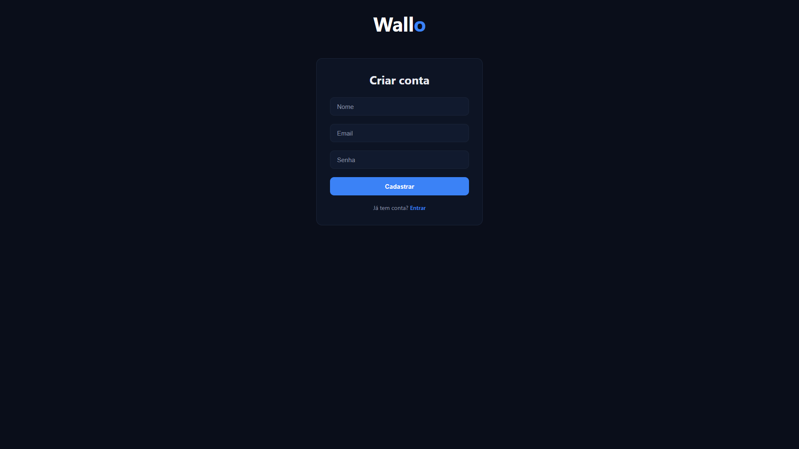
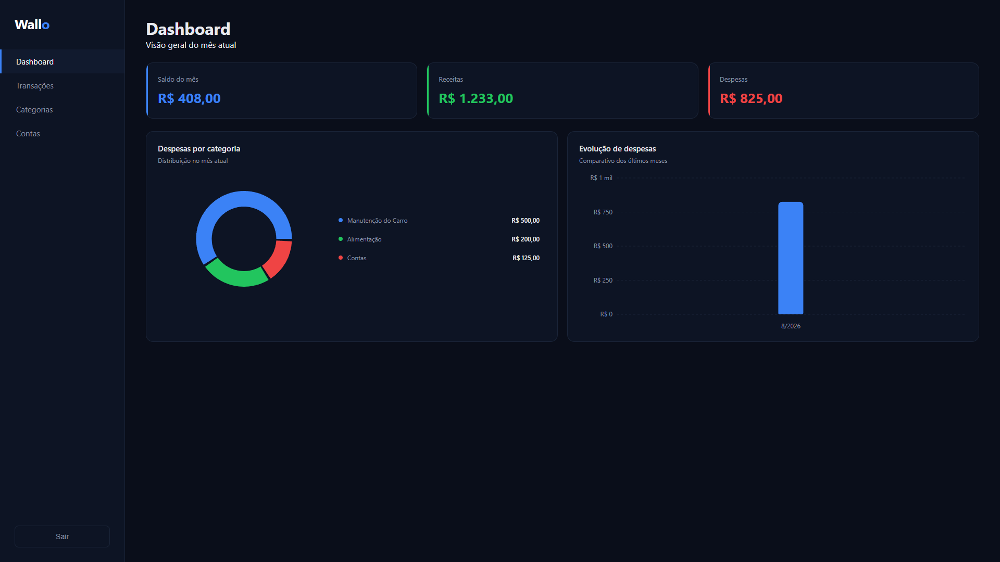
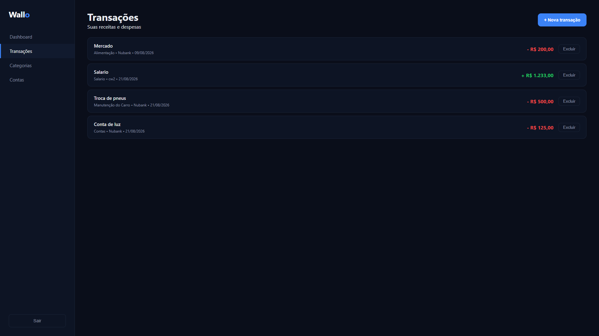
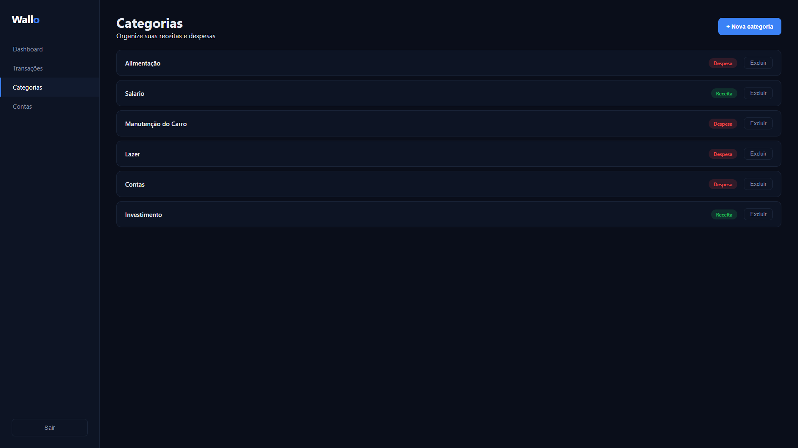
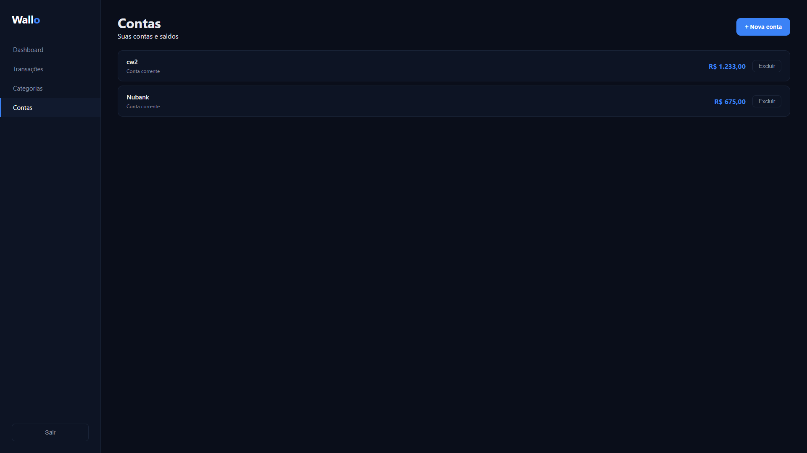

# Wallo — Web


Interface web do **Wallo**, um sistema de controle financeiro pessoal. Permite ao usuário acompanhar contas, categorias e transações, com um dashboard visual de receitas e despesas.

🔗 **[Acesse o Wallo ao vivo](https://wallo-frontend.vercel.app)**

> API REST (Spring Boot): [wallo-backend](https://github.com/davizmartins/wallo-backend)

## Screenshots








## Funcionalidades

- Cadastro e login de usuários com autenticação via JWT
- Rotas protegidas: telas internas só acessíveis com sessão válida
- Dashboard com cards de resumo e gráficos (despesas por categoria e evolução mensal)
- CRUD de categorias, contas e transações
- Formatação de valores em moeda brasileira (R$)
- Notificações via toast para feedback de ações e erros
- Interface responsiva com tema escuro

## Tecnologias

- **React** com **Vite**
- **React Router** para navegação e rotas protegidas
- **Axios** para comunicação com a API (com interceptadores de token)
- **Recharts** para os gráficos do dashboard
- **CSS** puro com variáveis para o tema

## Estrutura

- `pages` — telas da aplicação (Login, Cadastro, Dashboard, Categorias, Contas, Transações)
- `components` — componentes reutilizáveis (Layout, Modal, Toast, rota protegida)
- `services` — configuração do cliente HTTP (Axios)
- `routes.js` — definição centralizada das rotas

A comunicação com a API usa um cliente Axios central, que anexa automaticamente o token JWT às requisições e trata sessões expiradas.

## Deploy

O projeto está hospedado em produção:

- **Frontend:** [Vercel](https://wallo-frontend.vercel.app)
- **Backend:** [Render](https://wallo-backend-z0cb.onrender.com)
- **Banco de dados:** PostgreSQL (Neon)

> O backend usa o plano gratuito do Render, que suspende o serviço após um período de inatividade. O primeiro acesso pode levar até 1 minuto enquanto o servidor reinicia.

## Como executar localmente

### Pré-requisitos

- Node.js (versão 18 ou superior)
- A [API do Wallo](https://github.com/davizmartins/wallo-backend) rodando em `http://localhost:8080`

### Passos

1. Clone o repositório:
   ```bash
   git clone https://github.com/davizmartins/wallo-frontend.git
   cd wallo-frontend
   ```

2. Instale as dependências:
   ```bash
   npm install
   ```

3. Execute o projeto:
   ```bash
   npm run dev
   ```

4. Acesse `http://localhost:5173` no navegador.

## Autor

Desenvolvido por [Davi Martins](https://github.com/davizmartins).

